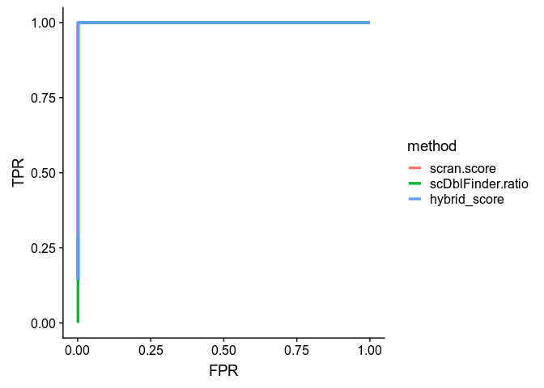
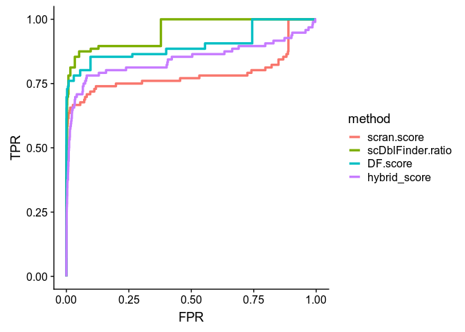
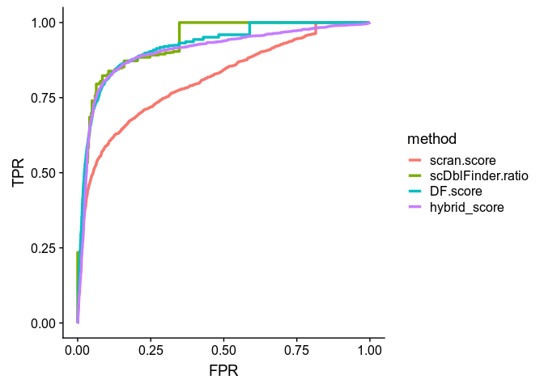
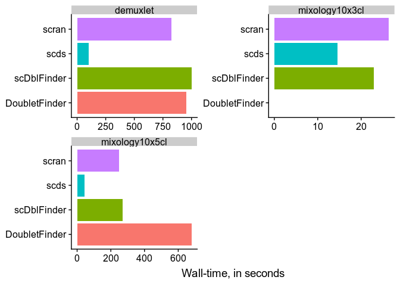

# scDblFinder

## Introduction

scDblFinder  identifies doublets in single-cell RNAseq directly by creating artificial doublets and looking at their prevalence in the neighborhood of each cell. The rough logic is very similar to *[DoubletFinder](https://github.com/chris-mcginnis-ucsf/DoubletFinder)*, but it much simpler and more efficient. In a nutshell:

* scDblFinder works directly on a reduced count matrix (using rank correlation on top expressed genes), making the detection independent of downstream processing. This avoids the need for all the Seurat pre-processing, making the detection faster and compatible with other analytic choices.
* instead of creating doublets from random pairs of cells, scDblFinder first overclusters the cells and create cross-cluster doublets. It also uses meta-cells from each cluster to create triplets. This strategy avoids creating homotypic doublets and enables the detection of most doublets with much fewer artificial doublets.
* while we also rely on the expected proportion of doublets to threshold the scores, we include a variability in the estimate of the doublet proportion (`dbr.sd`), and use the error rate of the real/artificial predicition in conjunction with the deviation in global doublet rate to set the threshold.

## Installation


```r
devtools::install_github('plger/scDblFinder')
```

## Usage

Given an object `sce` of class `SingleCellExperiment`:

```r
library(scDblFinder)
sce <- scDblFinder(sce)
```

This will add the following columns to the colData of `sce`:

* `sce$scDblFinder.neighbors` : the number of neighbors considered
* `sce$scDblFinder.ratio` :  the proportion of artificial doublets among the neighborhood (the higher, the more chances that the cell is a doublet)
* `sce$scDblFinder.class` : the classification (doublet or singlet)

### Parameters

The important sets of parameters in `scDblFinder` refer respectively to the expected proportion of doublets, to the clustering, and to the number of artificial doublets used.

#### Expected proportion of doublets

The expected proportion of doublets has no impact on the score (the `ratio` above), but a very strong impact on where the threshold will be placed. It is specified through the `dbr` parameter and the `dbr.sd` parameter (the latter specifies the standard deviation of `dbr`, i.e. the uncertainty in the expected doublet rate). By default, the expected doublet rate is set to 0.025 (2.5\%) with a standard deviation of 0.015, which is reasonable for recent 10x datasets. However, note that some older protocols or higher concentrations of cells create considerably more doublets, and that this should be updated accordingly.

#### Clustering

Since doublets are created across clusters, it is important that subpopulations are not misrepresented as belonging to the same cluster. For this reason, we rely on an over-clustering approach which is similar to *[scran](https://bioconductor.org/packages/3.9/scran)*'s `quickCluster`, but splits clusters above a certain size. This is implemented by scDblFinder's `overcluster` function. By default, the maximum cluster size will be 1/20 of the number of cells. While this is reasonable for most datasets (i.e. all those used for benchmark), so many clusters might be unnecessary when the cell population has a simple structure, and more clusters might be needed in a very complex population (e.g. whole brain).

#### Number of artificial doublets

`scDblFinder` itself determines a reasonable number of artificial doublets to create on the basis of the size of the population and the number of clusters, but increasing this number can only increase the accuracy. If you increase the number above default settings, you might also consider increasing parameter `k` - i.e. the number of neighbors considered.

<br/><br/>

# Comparison with other tools

To benchmark scDblFinder against alternatives, we used datasets in which cells from multiple individuals were mixed and their identity deconvoluted using SNPs (via *[demuxlet](https://github.com/statgen/demuxlet)*), which also enables the identification of doublets from different individuals.

The method is compared to:

* *[DoubletFinder](https://github.com/chris-mcginnis-ucsf/DoubletFinder)*
* *[scran](https://bioconductor.org/packages/3.9/scran)*'s `doubletCells` function
* *[scds](https://bioconductor.org/packages/3.9/scds)* (hybrid method)

## Mixology10x3cl




## Mixology10x5cl



## Demuxlet controls



## Running time


```
## Warning: Removed 1 rows containing missing values (position_stack).
```


^[DoubletFinder failed on the mixology10x3cl dataset]

Note that by far most of the running time of `scDblFinder` is actually the clustering.

# Session info {.unnumbered}


```
## R version 3.6.0 (2019-04-26)
## Platform: x86_64-pc-linux-gnu (64-bit)
## Running under: Ubuntu 18.04.2 LTS
## 
## Matrix products: default
## BLAS:   /usr/lib/x86_64-linux-gnu/openblas/libblas.so.3
## LAPACK: /usr/lib/x86_64-linux-gnu/libopenblasp-r0.2.20.so
## 
## locale:
##  [1] LC_CTYPE=en_US.UTF-8       LC_NUMERIC=C              
##  [3] LC_TIME=de_CH.UTF-8        LC_COLLATE=en_US.UTF-8    
##  [5] LC_MONETARY=de_CH.UTF-8    LC_MESSAGES=en_US.UTF-8   
##  [7] LC_PAPER=de_CH.UTF-8       LC_NAME=C                 
##  [9] LC_ADDRESS=C               LC_TELEPHONE=C            
## [11] LC_MEASUREMENT=de_CH.UTF-8 LC_IDENTIFICATION=C       
## 
## attached base packages:
## [1] stats     graphics  grDevices utils     datasets  methods   base     
## 
## other attached packages:
## [1] ROCit_1.1.1      scDblFinder_1.0  cowplot_0.9.4    ggplot2_3.1.1   
## [5] BiocStyle_2.12.0
## 
## loaded via a namespace (and not attached):
##  [1] Rcpp_1.0.1         highr_0.8          pillar_1.3.1      
##  [4] compiler_3.6.0     BiocManager_1.30.4 plyr_1.8.4        
##  [7] tools_3.6.0        digest_0.6.18      evaluate_0.13     
## [10] tibble_2.1.1       gtable_0.3.0       pkgconfig_2.0.2   
## [13] rlang_0.3.4        yaml_2.2.0         xfun_0.6          
## [16] withr_2.1.2        stringr_1.4.0      dplyr_0.8.0.1     
## [19] knitr_1.22         grid_3.6.0         tidyselect_0.2.5  
## [22] glue_1.3.1         R6_2.4.0           rmarkdown_1.12    
## [25] purrr_0.3.2        magrittr_1.5       scales_1.0.0      
## [28] htmltools_0.3.6    assertthat_0.2.1   colorspace_1.4-1  
## [31] labeling_0.3       stringi_1.4.3      lazyeval_0.2.2    
## [34] munsell_0.5.0      crayon_1.3.4
```
