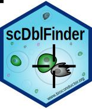
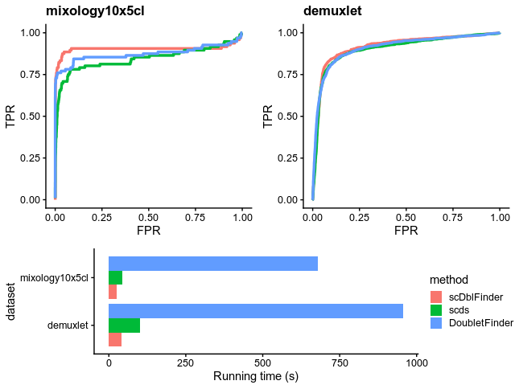

# scDblFinder

The `scDblFinder` package gathers various methods for the detection and handling of doublets/multiplets in single-cell sequencing data (i.e. multiple cells captured within the same droplet or reaction volume). The methods included here are _complementary_ to doublets detection via cell hashes and SNPs in multiplexed samples: while hashing/genotypes can identify doublets formed by cells of the same type (homotypic doublets) from two samples, which are often nearly undistinguishable from real cells transcriptionally (and hence generally unidentifiable through the present package), it cannot identify doublets made by cells of the same sample, even if they are heterotypic (formed by different cell types). Instead, the methods presented here are primarily geared towards the identification of heterotypic doublets, which for most purposes are also the most critical ones.

For a brief overview of the methods, see the [introductory vignette](https://bioconductor.org/packages/devel/bioc/vignettes/scDblFinder/inst/doc/1_introduction.html) (`vignette("introduction", package="scDblFinder")`). Here, we will showcase doublet detection using the fast and comprehensive `scDblFinder` method.

**scDblFinder has improved considerably since earlier versions, so please make sure you're using an up-to-date version!**

<br/><br/>

## Getting started

You may install the latest version of the package with:
```r
BiocManager::install("plger/scDblFinder")
```

Given an object `sce` of class `SingleCellExperiment` (which does not contain any empty drops, but hasn't been further filtered), you can launch the doublet detection with:

```r
library(scDblFinder)
sce <- scDblFinder(sce)
```

This will add a number of columns to the `colData` of `sce`, the most important of which are:

* `sce$scDblFinder.score` : the final doublet score (the higher the more likely that the cell is a doublet)
* `sce$scDblFinder.ratio` : the ratio of artificial doublets in the cell's neighborhood
* `sce$scDblFinder.class` : the classification (doublet or singlet)

There are several additional columns containing further information (e.g. the most likely origin of the putative doublet), an overview of which is available in the [vignette](https://bioconductor.org/packages/devel/bioc/vignettes/scDblFinder/inst/doc/2_scDblFinder.html) (`vignette("scDblFinder")`).

### Multiple samples

If you have multiple samples (understood as different cell captures, i.e. for multiplexed samples with cell hashes, rather use the well/batch), then it is preferable to provide `scDblFinder` with this information. The generation of artificial doublets and the characterization of the nearest neighbors will be performed separately for each capture, the final scoring will be performed globally, and the thresholding will take into consideration batch/sample-specific doublet rates. You can do this by simply providing a vector of the sample ids to the `samples` parameter of scDblFinder or,
if these are stored in a column of `colData`, the name of the column. In this case,
you might also consider multithreading it using the `BPPARAM` parameter. For example:

```r
library(BiocParallel)
sce <- scDblFinder(sce, samples="sample_id", BPPARAM=MulticoreParam(3))
table(sce$scDblFinder.class)
```

### Expected proportion of doublets

The expected proportion of doublets has no impact on the score, but a very strong impact on where the threshold will be placed (the thresholding procedure simultaneously minimizes classification error and departure from the expected doublet rate). It is specified through the `dbr` parameter and the `dbr.sd` parameter (the latter specifies the standard deviation of `dbr`, i.e. the uncertainty in the expected doublet rate). For 10x data, the more cells you capture the higher the chance of creating a doublet, and Chromium documentation indicates a doublet rate of roughly 1\% per 1000 cells captures (so with 5000 cells, (0.01\*5)\*5000 = 250 doublets), and the default expected doublet rate will be set to this value (with a default standard deviation of 0.015). Note however that different protocols may create considerably more doublets, and that this should be updated accordingly.

### Providing your own clustering

Contrarily to other methods also based on the generation of artificial doublets, `scDblFinder` does not generate them in an entirely random fashion, but specifically generates inter-cluster doublets. This also means that, for putative doublets among the real cells, `scDblFinder` can guess from what clusters their originate. To make this information easier to interpret, you may provide your own clusters (though the `clusters` argument) rather than use the fast internal procedure to determine them. It is important that subpopulations are not misrepresented as belonging to the same cluster, and for this reason, we favor over-clustering for this purpose. For more detail, or for application to datasets containing continuous gradients (e.g. trajectories) rather than distinct subpopulations, see [vignette("scDblFinder")](https://bioconductor.org/packages/devel/bioc/vignettes/scDblFinder/inst/doc/2_scDblFinder.html).

### Including known doublets

If you already know of some doublets in the data (e.g. identified via cell hashes and SNPs in multiplexed samples), providing this information through the `knownDoublets` can enable `scDblFinder` to identify similar doublets. However, if many of those doublets are homotypic (e.g. made from the same cell type, although from different individuals), this can lead to a decrease in accuracy.

## Single-cell ATACseq

We have not yet thoroughly tested the `scDblFinder` parameters in the context of scATACseq data, however preliminary results on a couple of datasets (applied on peak-level counts) suggest that it works decently there if one increases the `nfeatures`.

<br/><br/>

For more detail, please see [vignette("scDblFinder")](https://bioconductor.org/packages/devel/bioc/vignettes/scDblFinder/inst/doc/2_scDblFinder.html).

<br/><br/>

## Comparison with other tools

`scDblFinder` was independently evaluated by Nan Miles Xi and Jingyi Jessica Li in the [addendum](https://arxiv.org/abs/2101.08860) to their excellent [benchmark](https://doi.org/10.1016/j.cels.2020.11.008), where they write that _"scDblFinder achieves the highest mean AUPRC and AUROC values, and it is also the top method in terms of the precision, recall, and TNR under the 10% identification rate."_ In addition, it is roughly 10x faster (and scales much better) than the best alternative.


