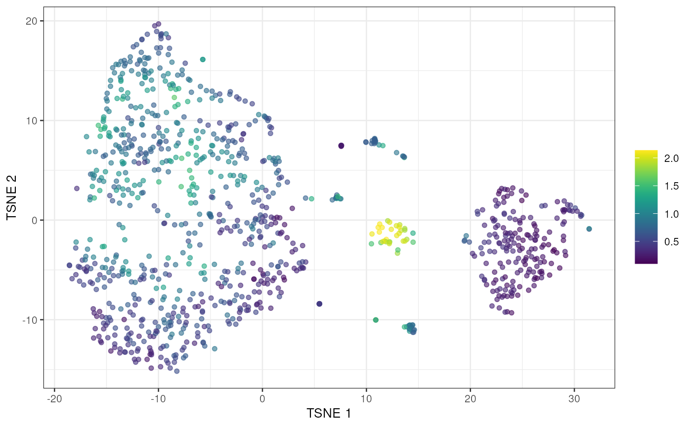

# Scoring potential doublets from simulated densities

## tl;dr

To demonstrate, we’ll use one of the mammary gland datasets from the
*[scRNAseq](https://bioconductor.org/packages/3.24/scRNAseq)* package.
We will subset it down to a random set of 1000 cells for speed.

``` r

library(scRNAseq)
sce <- BachMammaryData(samples="G_1")
```

``` r

set.seed(1001)
sce <- sce[,sample(ncol(sce), 1000)]
```

For the purposes of this demonstration, we’ll perform an extremely
expedited analysis. One would usually take more care here and do some
quality control, create some diagnostic plots, etc., but we don’t have
the space for that.

``` r

library(scrapper)
sce <- scrapper::analyze.se(sce)$x
```

We run
[`computeDoubletDensity()`](https://plger.github.io/scDblFinder/reference/computeDoubletDensity.md)
to obtain a doublet score for each cell based on the density of
simulated doublets around it. We log this to get some better dynamic
range.

``` r

set.seed(1003)
library(scDblFinder)
hvgs <- row.names(sce)[which(rowData(sce)$hvg)]
scores <- computeDoubletDensity(sce, subset.row=hvgs)
library(scater)
plotTSNE(sce, colour_by=I(log1p(scores)))
```



## Algorithm overview

We use a fairly simple approach in `doubletCells` that involves creating
simulated doublets from the original data set:

1.  Perform a PCA on the log-normalized expression for all cells in the
    dataset.
2.  Randomly select two cells and add their count profiles together.
    Compute the log-normalized profile and project it into the PC space.
3.  Repeat **2** to obtain $`N_s`$ simulated doublet cells.
4.  For each cell, compute the local density of simulated doublets,
    scaled by the density of the original cells. This is used as the
    doublet score.

## Size factor handling

### Normalization size factors

We allow specification of two sets of size factors for different
purposes. The first set is the normalization set: division of counts by
these size factors yields expression values to be compared across cells.
This is necessary to compute log-normalized expression values for the
PCA.

These size factors are usually computed from some method that assumes
most genes are not DE. We default to library size normalization though
any arbitrary set of size factors can be used. The size factor for each
doublet is computed as the sum of size factors for the individual cells,
based on the additivity of scaling biases.

### RNA content size factors

The second set is the RNA content set: division of counts by these size
factors yields expression values that are proportional to absolute
abundance across cells. This affects the creation of simulated doublets
by controlling the scaling of the count profiles for the individual
cells. These size factors would normally be estimated with spike-ins,
but in their absence we default to using unity for all cells.

The use of unity values implies that the library size for each cell is a
good proxy for total RNA content. This is unlikely to be true: technical
biases mean that the library size is an imprecise relative estimate of
the content. Saturation effects and composition biases also mean that
the expected library size for each population is not an accurate
estimate of content. The imprecision will spread out the simulated
doublets while the inaccuracy will result in a systematic shift from the
location of true doublets.

Arguably, such problems exist for any doublet estimation method without
spike-in information. We can only hope that the inaccuracies have only
minor effects on the creation of simulated cells. Indeed, the first
effect does mitigate the second to some extent by ensuring that some
simulated doublets will occupy the neighbourhood of the true doublets.

### Interactions between them

These two sets of size factors play different roles so it is possible to
specify both of them. We use the following algorithm to accommodate
non-unity values for the RNA content size factors:

1.  The RNA content size factors are used to scale the counts first.
    This ensures that RNA content has the desired effect in step **2**
    of Section @ref(overview).
2.  The normalization size factors are also divided by the content size
    factors. This ensures that normalization has the correct effect, see
    below.
3.  The rest of the algorithm proceeds as if the RNA content size
    factors were unity. Addition of count profiles is done without
    further scaling, and normalized expression values are computed with
    the rescaled normalization size factors.

To understand the correctness of the rescaled normalization size
factors, consider a non-DE gene with abundance $`\lambda_g`$. The
expected count in each cell is $`\lambda_g s_i`$ for scaling bias
$`s_i`$ (i.e., normalization size factor). The rescaled count is
$`\lambda_g s_i c_i^{-1}`$ for some RNA content size factor $`c_i`$. The
rescaled normalization size factor is $`s_i c_i^{-1}`$, such that
normalization yields $`\lambda_g`$ as desired. This also holds for
doublets where the scaling biases and size factors are additive.

## Doublet score calculations

We assume that the simulation accurately mimics doublet creation -
amongst other things, we assume that doublets are equally likely to form
between any cell populations and any differences in total RNA between
subpopulations are captured or negligible. If these assumptions hold,
then at any given region in the expression space, the number of doublets
among the real cells is proportional to the number of simulated doublets
lying in the same region. Thus, the probability that a cell is a doublet
is proportional to the ratio of the number of neighboring simulated
doublets to the number of neighboring real cells.

A mild additional challenge here is that the number of simulated cells
$`N_s`$ can vary. Ideally, we would like the expected output of the
function to be the same regardless of the user’s choice of $`N_s`$,
i.e., the chosen value should only affect the precision/speed trade-off.
Many other doublet-based methods take a $`k`$-nearest neighbours
approach to compute densities; but if $`N_s`$ is too large relative to
the number of real cells, all of the $`k`$ nearest neighbours will be
simulated, while if $`N_s`$ is too small, all of the nearest neighbors
will be original cells.

Thus, we use a modified version of the $`k`$NN approach whereby we
identify the distance from each cell to its $`k`$-th nearest neighbor.
This defines a hypersphere around that cell in which we count the number
of simulated cells. We then compute the odds ratio of the number of
simulated cells in the hypersphere to $`N_s`$, divided by the ratio of
$`k`$ to the total number of cells in the dataset. This score captures
the relative frequency of simulated cells to real cells while being
robust to changes to $`N_s`$.

## Session information

``` r

sessionInfo()
```

    ## R version 4.6.0 (2026-04-24)
    ## Platform: x86_64-pc-linux-gnu
    ## Running under: Ubuntu 24.04.4 LTS
    ## 
    ## Matrix products: default
    ## BLAS:   /usr/lib/x86_64-linux-gnu/openblas-pthread/libblas.so.3 
    ## LAPACK: /usr/lib/x86_64-linux-gnu/openblas-pthread/libopenblasp-r0.3.26.so;  LAPACK version 3.12.0
    ## 
    ## locale:
    ##  [1] LC_CTYPE=en_US.UTF-8       LC_NUMERIC=C              
    ##  [3] LC_TIME=en_US.UTF-8        LC_COLLATE=en_US.UTF-8    
    ##  [5] LC_MONETARY=en_US.UTF-8    LC_MESSAGES=en_US.UTF-8   
    ##  [7] LC_PAPER=en_US.UTF-8       LC_NAME=C                 
    ##  [9] LC_ADDRESS=C               LC_TELEPHONE=C            
    ## [11] LC_MEASUREMENT=en_US.UTF-8 LC_IDENTIFICATION=C       
    ## 
    ## time zone: Etc/UTC
    ## tzcode source: system (glibc)
    ## 
    ## attached base packages:
    ## [1] stats4    stats     graphics  grDevices utils     datasets  methods  
    ## [8] base     
    ## 
    ## other attached packages:
    ##  [1] scater_1.41.1               ggplot2_4.0.3              
    ##  [3] scuttle_1.23.1              scDblFinder_1.27.6         
    ##  [5] scrapper_1.7.3              ensembldb_2.37.3           
    ##  [7] AnnotationFilter_1.37.0     GenomicFeatures_1.65.0     
    ##  [9] AnnotationDbi_1.75.0        scRNAseq_2.27.0            
    ## [11] SingleCellExperiment_1.35.1 SummarizedExperiment_1.43.0
    ## [13] Biobase_2.73.1              GenomicRanges_1.65.0       
    ## [15] Seqinfo_1.3.0               IRanges_2.47.2             
    ## [17] S4Vectors_0.51.3            BiocGenerics_0.59.7        
    ## [19] generics_0.1.4              MatrixGenerics_1.25.0      
    ## [21] matrixStats_1.5.0           BiocStyle_2.41.0           
    ## 
    ## loaded via a namespace (and not attached):
    ##   [1] RColorBrewer_1.1-3       jsonlite_2.0.0           magrittr_2.0.5          
    ##   [4] ggbeeswarm_0.7.3         gypsum_1.9.0             farver_2.1.2            
    ##   [7] rmarkdown_2.31           fs_2.1.0                 BiocIO_1.23.3           
    ##  [10] ragg_1.5.2               vctrs_0.7.3              memoise_2.0.1           
    ##  [13] Rsamtools_2.29.0         RCurl_1.98-1.19          htmltools_0.5.9         
    ##  [16] S4Arrays_1.13.0          BiocBaseUtils_1.15.1     AnnotationHub_4.3.0     
    ##  [19] curl_7.1.0               BiocNeighbors_2.7.2      xgboost_3.2.1.1         
    ##  [22] Rhdf5lib_2.1.0           SparseArray_1.13.2       rhdf5_2.57.1            
    ##  [25] sass_0.4.10              alabaster.base_1.13.0    bslib_0.11.0            
    ##  [28] htmlwidgets_1.6.4        desc_1.4.3               alabaster.sce_1.13.0    
    ##  [31] httr2_1.2.2              cachem_1.1.0             GenomicAlignments_1.49.0
    ##  [34] igraph_2.3.2             lifecycle_1.0.5          pkgconfig_2.0.3         
    ##  [37] rsvd_1.0.5               Matrix_1.7-5             R6_2.6.1                
    ##  [40] fastmap_1.2.0            digest_0.6.39            irlba_2.3.7             
    ##  [43] ExperimentHub_3.3.0      textshaping_1.0.5        RSQLite_3.53.1          
    ##  [46] beachmat_2.29.0          labeling_0.4.3           filelock_1.0.3          
    ##  [49] httr_1.4.8               abind_1.4-8              compiler_4.6.0          
    ##  [52] bit64_4.8.2              withr_3.0.2              S7_0.2.2                
    ##  [55] BiocParallel_1.47.0      viridis_0.6.5            DBI_1.3.0               
    ##  [58] HDF5Array_1.41.0         alabaster.ranges_1.13.0  alabaster.schemas_1.13.0
    ##  [61] MASS_7.3-65              rappdirs_0.3.4           DelayedArray_0.39.3     
    ##  [64] rjson_0.2.23             bluster_1.23.0           tools_4.6.0             
    ##  [67] vipor_0.4.7              otel_0.2.0               beeswarm_0.4.0          
    ##  [70] glue_1.8.1               h5mread_1.5.0            restfulr_0.0.17         
    ##  [73] rhdf5filters_1.25.0      grid_4.6.0               cluster_2.1.8.2         
    ##  [76] gtable_0.3.6             data.table_1.18.4        BiocSingular_1.29.0     
    ##  [79] ScaledMatrix_1.21.0      XVector_0.53.0           ggrepel_0.9.8           
    ##  [82] BiocVersion_3.24.0       pillar_1.11.1            dplyr_1.2.1             
    ##  [85] BiocFileCache_3.3.0      lattice_0.22-9           rtracklayer_1.73.0      
    ##  [88] bit_4.6.0                tidyselect_1.2.1         Biostrings_2.81.3       
    ##  [91] knitr_1.51               gridExtra_2.3            bookdown_0.46           
    ##  [94] ProtGenerics_1.45.0      xfun_0.58                UCSC.utils_1.9.0        
    ##  [97] lazyeval_0.2.3           yaml_2.3.12              evaluate_1.0.5          
    ## [100] codetools_0.2-20         cigarillo_1.3.0          tibble_3.3.1            
    ## [103] alabaster.matrix_1.13.0  BiocManager_1.30.27      cli_3.6.6               
    ## [106] systemfonts_1.3.2        jquerylib_0.1.4          Rcpp_1.1.1-1.1          
    ## [109] GenomeInfoDb_1.49.1      dbplyr_2.5.2             png_0.1-9               
    ## [112] XML_3.99-0.23            parallel_4.6.0           pkgdown_2.2.0           
    ## [115] blob_1.3.0               bitops_1.0-9             viridisLite_0.4.3       
    ## [118] alabaster.se_1.13.0      scales_1.4.0             purrr_1.2.2             
    ## [121] crayon_1.5.3             rlang_1.2.0              KEGGREST_1.53.0
