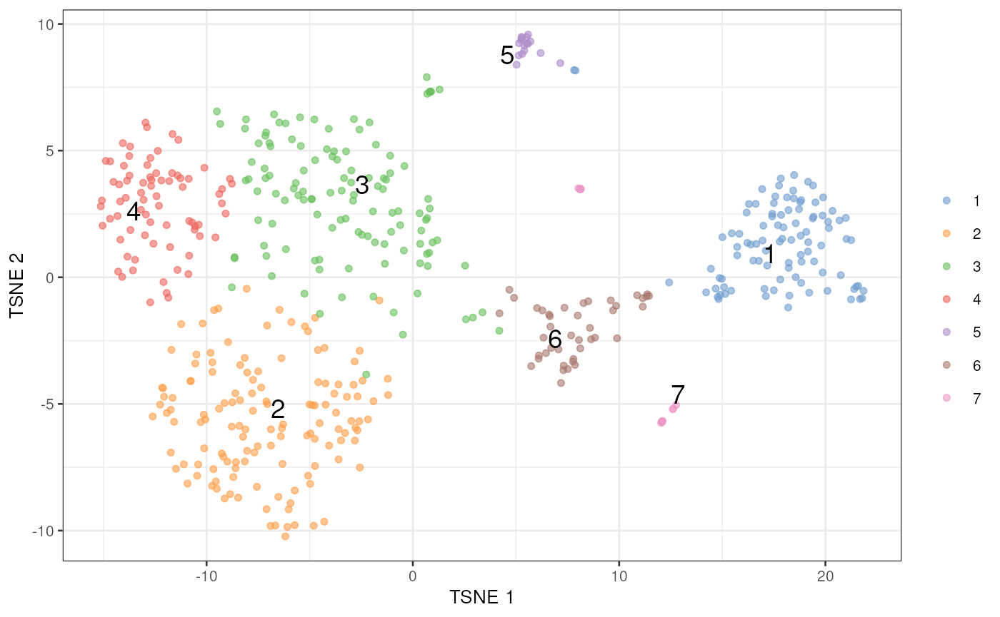

# Detecting clusters of doublet cells with DE analyses

## tl;dr

To demonstrate, we’ll use one of the mammary gland datasets from the
*[scRNAseq](https://bioconductor.org/packages/3.23/scRNAseq)* package.
We will subset it down to a random set of 500 cells for speed.

``` r
library(scRNAseq)
sce <- BachMammaryData(samples="G_2")
```

``` r
set.seed(1000)
sce <- sce[,sample(ncol(sce), 500)]
```

For the purposes of this demonstration, we’ll perform an extremely
expedited analysis. One would usually take more care here and do some
quality control, create some diagnostic plots, etc., but we don’t have
the space for that.

``` r
library(scuttle)
sce <- logNormCounts(sce)

library(scran)
dec <- modelGeneVar(sce)

library(scater)
set.seed(1000)
sce <- runPCA(sce, ncomponents=10, subset_row=getTopHVGs(dec, n=1000))

library(bluster)
clusters <- clusterRows(reducedDim(sce, "PCA"), NNGraphParam())

sce <- runTSNE(sce, dimred="PCA")
plotTSNE(sce, colour_by=I(clusters), text_by=I(clusters))
```



We then run
[`findDoubletClusters()`](https://plger.github.io/scDblFinder/reference/findDoubletClusters.md)
to test each cluster against the null hypothesis that it *does* consist
of doublets. The null is rejected if a cluster has many DE genes that
lie outside the expression limits defined by the “source” clusters. On
the other hand, if `num.de` is low, the cluster’s expression profile is
consistent with the doublet hypothesis.

``` r
library(scDblFinder)
tab <- findDoubletClusters(sce, clusters)
tab
```

    ## DataFrame with 7 rows and 9 columns
    ##       source1     source2    num.de median.de               best     p.value
    ##   <character> <character> <integer> <integer>        <character>   <numeric>
    ## 6           2           1         0       122 ENSMUSG00000019256 1.00000e+00
    ## 3           6           5         8        46 ENSMUSG00000002985 8.41352e-05
    ## 7           5           1        11       393 ENSMUSG00000075705 2.04690e-10
    ## 4           7           2        24        63 ENSMUSG00000022491 4.15645e-13
    ## 1           7           6        86       715 ENSMUSG00000001349 8.49703e-08
    ## 5           7           2       112      1007 ENSMUSG00000024610 2.38765e-11
    ## 2           6           5       124       336 ENSMUSG00000023505 4.06936e-06
    ##   lib.size1 lib.size2      prop
    ##   <numeric> <numeric> <numeric>
    ## 6  0.927081  0.443667     0.084
    ## 3  2.026090  0.859424     0.242
    ## 7  1.195040  1.249946     0.030
    ## 4  0.630479  1.646729     0.150
    ## 1  0.800035  2.253942     0.192
    ## 5  0.836792  2.185591     0.032
    ## 2  1.078655  0.457542     0.270

## Mathematical background

Consider a cell population $i$ that has mean transcript count
$\lambda_{gi}$ for gene $g$. Assume that each population exhibits a
unique scaling bias $s_{i}$, representing the efficiency of library
preparation for that population. The observed read/UMI count for each
gene is then $\mu_{gi} = s_{i}\lambda_{gi}$. (For simplicity, we will
ignore gene-specific scaling biases, as this is easily accommodated by
considering $\lambda_{gi} \equiv \phi_{g}\lambda_{gi}$ for some bias
$\phi_{g}$.) The expected total count for each population is
$N_{i} = \sum_{g}\mu_{gi}$.

Now, let us consider a doublet population $j$ that forms from two parent
populations $i_{1}$ and $i_{2}$. The observed read count for $g$ in $j$
is $\mu_{gj} = s_{j}\left( \lambda_{gi_{1}} + \lambda_{gi_{2}} \right)$.
Note that $s_{j}$ need not be any particular function of $s_{i_{1}}$ and
$s_{i_{2}}$. Rather, this relationship depends on how quickly the
reverse transcription and amplification reagents are saturated during
library preparation, which is difficult to make assumptions around.

## Normalization by library size

We obtain log-normalized expression values for each cell based on the
library size. Assume that the library size-normalized expression values
are such that
$\mu_{gi_{1}}N_{i_{1}}^{- 1} < \mu_{gi_{2}}N_{i_{2}}^{- 1}$, i.e., the
proportion of $g$ increases in $i_{2}$ compared to $i_{1}$. The
contribution of each $s_{i}$ cancels out, yielding
$$\frac{\lambda_{gi_{1}}}{\sum\limits_{g}\lambda_{gi_{1}}} < \frac{\lambda_{gi_{2}}}{\sum\limits_{g}\lambda_{gi_{2}}}\;.$$
The normalized expression value of the doublet cluster $j$ is
subsequently
$$\frac{\lambda_{gi_{1}} + \lambda_{gi_{2}}}{\sum\limits_{g}\left( \lambda_{gi_{1}} + \lambda_{gi_{2}} \right)}\;,$$
and it is fairly easy to show that
$$\frac{\lambda_{gi_{1}}}{\sum\limits_{g}\lambda_{gi_{1}}} < \frac{\lambda_{gi_{1}} + \lambda_{gi_{2}}}{\sum\limits_{g}\left( \lambda_{gi_{1}} + \lambda_{gi_{2}} \right)} < \frac{\lambda_{gi_{2}}}{\sum\limits_{g}\lambda_{gi_{2}}}\;.$$
In other words, the expected library size-normalized expression of our
gene in the doublet cluster lies between that of the two parents.

It is harder to provide theoretical guarantees with arbitrary size
factors, which is why we only use the library sizes for normalization
instead. The exception is that of spike-in size factors that would
estimate $s_{i}$ directly. This would allow us to obtain estimates of
$\lambda_{gi}$ for the parent clusters and of
$\lambda_{gi_{1}} + \lambda_{gi_{2}}$ for the doublets. In this manner,
we could more precisely identify doublet clusters as those where the
normalized expression value is equal to the sum of the parents.
Unfortunately, spike-ins are generally not available for droplet-based
data sets where doublets are most problematic.

## Testing for (lack of) intermediacy

We want to identify the clusters that may be comprised of doublets of
other clusters. For each cluster $j\prime$, we test for differential
expression in the library size-normalized expression profiles against
every other cluster $i\prime$. For each pair of other clusters
$i\prime_{1}$ and $i\prime_{2}$, we identify genes that change in
$j\prime$ against both $i\prime_{1}$ and $i\prime_{2}$**in the same
direction**. The presence of such genes violates the intermediacy
expected of a doublet cluster and provides evidence that $j\prime$ is
not a doublet of $i\prime_{1}$ and $i\prime_{2}$.

Significant genes are identified by an intersection-union test on the
$p$-values from the pairwise comparisons between $j\prime$ and
$i\prime_{1}$ or $i\prime_{2}$. (Specifically, $t$-tests are used via
the [`findMarkers()`](https://rdrr.io/pkg/scran/man/findMarkers.html)
function from *[scran](https://bioconductor.org/packages/3.23/scran)*.)
The $p$-value for a gene is set to unity when the signs of the log-fold
changes are not the same between comparisons. Multiple correction
testing is applied using the Benjamini-Hochberg method, and the number
of genes detected at a specified false discovery rate (usually 5%) is
counted. The pair $\left( i\prime_{1},i\prime_{2} \right)$ with the
fewest detected genes are considered as the putative parents of
$j\prime$.

In theory, it is possible to compute the Simes’ combined $p$-value
across all genes to reject the doublet hypothesis for $j\prime$. This
would provide a more rigorous approach to ruling out potential
doublet/parent combinations. However, this is very sensitive to
misspecification of clusters – see below.

## Calling doublet clusters

Assuming that most clusters are not comprised of doublets, we identify
clusters that have an unusually low number of detected genes that
violate the intermediacy condition. This is achieved by identifying
small outliers on the log-transformed number of detected genes, using
the median absolute deviation-based method in the function. (We use a
log-transformation simply to improve resolution at low values.) Clusters
are likely to be doublets if they are outliers on this metric.

Doublet clusters should also have larger library sizes than the proposed
parent clusters. This is consistent with the presence of more RNA in
each doublet, though the library size of the doublet cluster need not be
a sum of that of the parent clusters (due to factors such as saturation
and composition effects). The proportion of cells assigned to the
doublet cluster should also be “reasonable”; exactly what this means
depends on the experimental setup and the doublet rate of the protocol
in use.

## Discussion

The biggest advantage of this approach lies in its interpretability.
Given a set of existing clusters, we can explicitly identify those that
are likely to be doublets. We also gain some insight onto the parental
origins of each putative doublet cluster, which may be of some interest.
We avoid any assumptions about doublet formation that are otherwise
necessary for the simulation-based methods. In particular, we do not
require any knowledge about exact the relationship between $s_{j}$ and
$s_{i}$, allowing us to identify doublets even when the exact location
of the doublet is unknown (e.g., due to differences in RNA content
between the parent clusters).

The downside is that, of course, we are dependent on being supplied with
sensible clusters where the parental and doublet cells are separated.
The intermediacy requirement is loose enough to provide some robustness
against misspecification, but this only goes so far. In addition, this
strategy has a bias towards calling clusters with few cells as doublets
(or parents of doublets) because the DE detection power is low. This can
be somewhat offset by comparing `num.de` against `median.de` as latter
will be low for clusters involved in systematically low-powered
comparisons, though it is difficult to adjust for the exact effect of
the differences of power on the IUT.

## Session information

``` r
sessionInfo()
```

    ## R Under development (unstable) (2026-02-08 r89382)
    ## Platform: x86_64-pc-linux-gnu
    ## Running under: Ubuntu 24.04.3 LTS
    ## 
    ## Matrix products: default
    ## BLAS:   /usr/lib/x86_64-linux-gnu/openblas-pthread/libblas.so.3 
    ## LAPACK: /usr/lib/x86_64-linux-gnu/openblas-pthread/libopenblasp-r0.3.26.so;  LAPACK version 3.12.0
    ## 
    ## locale:
    ##  [1] LC_CTYPE=en_US.UTF-8       LC_NUMERIC=C              
    ##  [3] LC_TIME=en_US.UTF-8        LC_COLLATE=en_US.UTF-8    
    ##  [5] LC_MONETARY=en_US.UTF-8    LC_MESSAGES=en_US.UTF-8   
    ##  [7] LC_PAPER=en_US.UTF-8       LC_NAME=C                 
    ##  [9] LC_ADDRESS=C               LC_TELEPHONE=C            
    ## [11] LC_MEASUREMENT=en_US.UTF-8 LC_IDENTIFICATION=C       
    ## 
    ## time zone: Etc/UTC
    ## tzcode source: system (glibc)
    ## 
    ## attached base packages:
    ## [1] stats4    stats     graphics  grDevices utils     datasets  methods  
    ## [8] base     
    ## 
    ## other attached packages:
    ##  [1] scDblFinder_1.25.4          bluster_1.21.0             
    ##  [3] scater_1.39.2               ggplot2_4.0.2              
    ##  [5] scran_1.39.0                scuttle_1.21.0             
    ##  [7] ensembldb_2.35.0            AnnotationFilter_1.35.0    
    ##  [9] GenomicFeatures_1.63.1      AnnotationDbi_1.73.0       
    ## [11] scRNAseq_2.25.0             SingleCellExperiment_1.33.0
    ## [13] SummarizedExperiment_1.41.1 Biobase_2.71.0             
    ## [15] GenomicRanges_1.63.1        Seqinfo_1.1.0              
    ## [17] IRanges_2.45.0              S4Vectors_0.49.0           
    ## [19] BiocGenerics_0.57.0         generics_0.1.4             
    ## [21] MatrixGenerics_1.23.0       matrixStats_1.5.0          
    ## [23] BiocStyle_2.39.0           
    ## 
    ## loaded via a namespace (and not attached):
    ##   [1] RColorBrewer_1.1-3       jsonlite_2.0.0           magrittr_2.0.4          
    ##   [4] ggbeeswarm_0.7.3         gypsum_1.7.0             farver_2.1.2            
    ##   [7] rmarkdown_2.30           fs_1.6.6                 BiocIO_1.21.0           
    ##  [10] ragg_1.5.0               vctrs_0.7.1              memoise_2.0.1           
    ##  [13] Rsamtools_2.27.0         RCurl_1.98-1.17          htmltools_0.5.9         
    ##  [16] S4Arrays_1.11.1          AnnotationHub_4.1.0      curl_7.0.0              
    ##  [19] BiocNeighbors_2.5.3      xgboost_3.2.0.1          Rhdf5lib_1.33.0         
    ##  [22] SparseArray_1.11.10      rhdf5_2.55.13            sass_0.4.10             
    ##  [25] alabaster.base_1.11.2    bslib_0.10.0             htmlwidgets_1.6.4       
    ##  [28] desc_1.4.3               alabaster.sce_1.11.0     httr2_1.2.2             
    ##  [31] cachem_1.1.0             GenomicAlignments_1.47.0 igraph_2.2.1            
    ##  [34] lifecycle_1.0.5          pkgconfig_2.0.3          rsvd_1.0.5              
    ##  [37] Matrix_1.7-4             R6_2.6.1                 fastmap_1.2.0           
    ##  [40] digest_0.6.39            dqrng_0.4.1              irlba_2.3.7             
    ##  [43] ExperimentHub_3.1.0      textshaping_1.0.4        RSQLite_2.4.6           
    ##  [46] beachmat_2.27.2          labeling_0.4.3           filelock_1.0.3          
    ##  [49] httr_1.4.7               abind_1.4-8              compiler_4.6.0          
    ##  [52] bit64_4.6.0-1            withr_3.0.2              S7_0.2.1                
    ##  [55] BiocParallel_1.45.0      viridis_0.6.5            DBI_1.2.3               
    ##  [58] HDF5Array_1.39.0         alabaster.ranges_1.11.0  alabaster.schemas_1.11.0
    ##  [61] MASS_7.3-65              rappdirs_0.3.4           DelayedArray_0.37.0     
    ##  [64] rjson_0.2.23             tools_4.6.0              vipor_0.4.7             
    ##  [67] otel_0.2.0               beeswarm_0.4.0           glue_1.8.0              
    ##  [70] h5mread_1.3.1            restfulr_0.0.16          rhdf5filters_1.23.3     
    ##  [73] grid_4.6.0               Rtsne_0.17               cluster_2.1.8.2         
    ##  [76] gtable_0.3.6             data.table_1.18.2.1      metapod_1.19.1          
    ##  [79] BiocSingular_1.27.1      ScaledMatrix_1.19.0      XVector_0.51.0          
    ##  [82] ggrepel_0.9.6            BiocVersion_3.23.1       pillar_1.11.1           
    ##  [85] limma_3.67.0             dplyr_1.2.0              BiocFileCache_3.1.0     
    ##  [88] lattice_0.22-9           rtracklayer_1.71.3       bit_4.6.0               
    ##  [91] tidyselect_1.2.1         locfit_1.5-9.12          Biostrings_2.79.4       
    ##  [94] knitr_1.51               gridExtra_2.3            bookdown_0.46           
    ##  [97] ProtGenerics_1.43.0      edgeR_4.9.2              xfun_0.56               
    ## [100] statmod_1.5.1            UCSC.utils_1.7.1         lazyeval_0.2.2          
    ## [103] yaml_2.3.12              evaluate_1.0.5           codetools_0.2-20        
    ## [106] cigarillo_1.1.0          tibble_3.3.1             alabaster.matrix_1.11.0 
    ## [109] BiocManager_1.30.27      cli_3.6.5                systemfonts_1.3.1       
    ## [112] jquerylib_0.1.4          Rcpp_1.1.1               GenomeInfoDb_1.47.2     
    ## [115] dbplyr_2.5.1             png_0.1-8                XML_3.99-0.22           
    ## [118] parallel_4.6.0           pkgdown_2.2.0            blob_1.3.0              
    ## [121] bitops_1.0-9             viridisLite_0.4.3        alabaster.se_1.11.0     
    ## [124] scales_1.4.0             purrr_1.2.1              crayon_1.5.3            
    ## [127] rlang_1.1.7              KEGGREST_1.51.1
