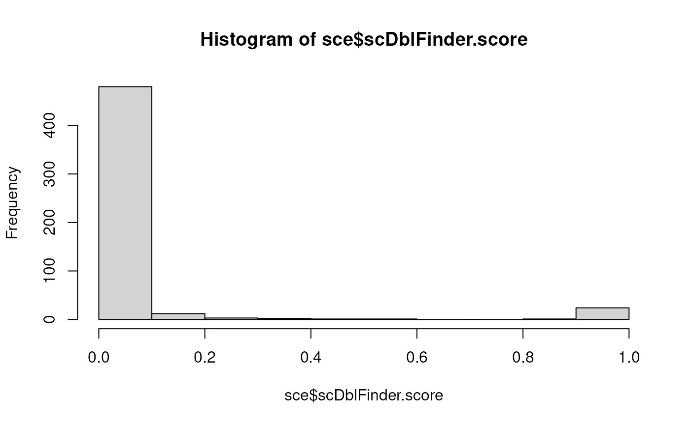

# scDblFinder

Abstract

An introduction to the scDblFinder method for fast and comprehensive
doublet identification in single-cell data.

## scDblFinder

The `scDblFinder` method combines the strengths of various doublet
detection approaches, training an iterative classifier on the
neighborhood of real cells and artificial doublets.

[`scDblFinder()`](https://plger.github.io/scDblFinder/reference/scDblFinder.md)
has two main modes of operation: cluster-based or not. Both perform
quite well (see [Germain et al.,
2021](https://f1000research.com/articles/10-979)). In general, we
recommend the cluster-based approach in datasets with a very clear
cluster structure, and the random approach in more complex datasets.

### Installation

``` r

if (!requireNamespace("BiocManager", quietly = TRUE))
    install.packages("BiocManager")
BiocManager::install("scDblFinder")

# or, to get that latest developments:
BiocManager::install("plger/scDblFinder")
```

### Usage

The input of `scDblFinder` is an object `sce` of class
*[SingleCellExperiment](https://bioconductor.org/packages/3.24/SingleCellExperiment)*
(empty drops having already been removed) containing at least the counts
(assay ‘counts’). Alternatively, a simple count matrix can also be
provided.

Given an SCE object, `scDblFinder` (using the random approach) can be
launched as follows :

``` r

set.seed(123)
suppressPackageStartupMessages(library(scDblFinder))
# we create a dummy dataset; since it's small we set a higher doublet rate
sce <- mockDoubletSCE(dbl.rate=0.1, ngenes=300 )
# we run scDblFinder (providing the unusually high doublet rate)
sce <- scDblFinder(sce, dbr=0.1)
```

    ## Creating ~1500 artificial doublets...

    ## Dimensional reduction

    ## Evaluating kNN...

    ## Training model...

    ## iter=0, 37 cells excluded from training.

    ## iter=1, 26 cells excluded from training.

    ## iter=2, 28 cells excluded from training.

    ## Threshold found:0.382

    ## 28 (5.3%) doublets called

For 10x data, it is usually safe to leave the `dbr` empty, and it will
be automatically estimated. (If using a chip other than the standard
10X, you might have to adjust it or the related `dbr.per1k` argument.

`scDblFinder` will add a number of columns to the colData of `sce`
prefixed with ‘scDblFinder’, the most important of which are:

- `sce$scDblFinder.score` : the final doublet score
- `sce$scDblFinder.class` : the classification (doublet or singlet)

We can compare the calls with the truth in this toy example:

``` r

table(truth=sce$type, call=sce$scDblFinder.class)
```

    ##          call
    ## truth     singlet doublet
    ##   singlet     496       4
    ##   doublet       0      24

Since most of the time the truth is not known, a good, simple diagnostic
is the distribution of doublet score:

``` r

hist(sce$scDblFinder.score)
```

 A bimodal
distribution, with most values very close to 0, a few close to 1, and
very little in-between is the sign that scDblFinder is able to do its
job.

#### Cluster-based approach

To use the cluster-based approach, one simply needs to additionally
provide the `clusters` argument:

``` r

sce <- scDblFinder(sce, clusters="cluster")
```

    ## 2 clusters

    ## Creating ~1500 artificial doublets...

    ## Dimensional reduction

    ## Evaluating kNN...

    ## Training model...

    ## iter=0, 24 cells excluded from training.

    ## iter=1, 24 cells excluded from training.

    ## iter=2, 24 cells excluded from training.

    ## Threshold found:0.998

    ## 24 (4.6%) doublets called

``` r

table(truth=sce$type, call=sce$scDblFinder.class)
```

    ##          call
    ## truth     singlet doublet
    ##   singlet     500       0
    ##   doublet       0      24

The `clusters` argument can be either a vector of cluster labels for
each column of `sce`, a colData column of `sce` containing such labels,
or `TRUE`. If `clusters=TRUE`, the fast clustering approach (see
[`?fastcluster`](https://plger.github.io/scDblFinder/reference/fastcluster.md))
will be employed. If normalized expression (assay ‘logcounts’) and/or
PCA (reducedDim ‘PCA’) are already present in the object, these will be
used for the clustering step.

#### Multiple samples

If you have multiple samples (understood as different cell captures),
then it is preferable to look for doublets separately for each sample
(for multiplexed samples with cell hashes, this means for each batch).
You can do this by simply providing a vector of the sample ids to the
`samples` parameter of `scDblFinder` or, if these are stored in a column
of `colData`, the name of the column. In this case, you might also
consider multithreading it using the `BPPARAM` parameter (assuming
you’ve got enough RAM!). For example:

``` r

library(BiocParallel)
sce <- scDblFinder(sce, samples="sample_id", BPPARAM=MulticoreParam(3))
table(sce$scDblFinder.class)
```

Note that if you are running multiple samples using the cluster-based
approach (see below), clustering will be performed sample-wise. While
this is typically not an issue for doublet identification, it means that
the cluster labels (and putative origins of doublets) won’t match
between samples. If you are interested in these, it is preferable to
first cluster (for example using `sce$cluster <- fastcluster(sce)`) and
then provide the clusters to `scDblFinder`, which will ensure concordant
labels across samples.

Of note, if you have very large differences in number of cells between
samples the scores will not be directly comparable. We are working on
improving this, but in the meantime it would be preferable to stratify
similar samples and threshold the sets separately.

  
  

### Description of the method

Wrapped in the `scDblFinder` function are the following steps:

#### Splitting captures

Doublets can only arise within a given sample or capture, and for this
reason are better sought independently for each sample, which also
speeds up the analysis. If the `samples` argument is given,
`scDblFinder` will use it to split the cells into samples/captures, and
process each of them in parallel if the `BPPARAM` argument is given.
Depending on the `multiSampleMode` argument, the classifier can be
trained globally, with thresholds optimized on a per-sample basis;
however we did not see an improvement in doing so, and therefore by
default each sample is treated separately to maximize robustness to
technical differences.

If your samples are multiplexed, i.e. the different samples are mixed in
different batches, then the batches should be what you provide to this
argument.

#### Reducing and clustering the data

The analysis can be considerably sped up, at little if any cost in
accuracy, by reducing the dataset to only the top expressed genes
(controlled by the `nfeatures` argument).

Then, depending on the `clusters` argument, an eventual PCA and
clustering (using the internal `fastcluster` function) will be
performed. The rationale for the cluster-based approach is that
homotypic doublets are nearly impossible to distinguish on the basis of
their transcriptome, and therefore that creating that kind of doublets
is a waste of computational resources that can moreover mislead the
classifier into flagging singlets. An alternative approach, however, is
to generate doublets randomly (setting `clusters` to FALSE or NULL), and
use the iterative approach (see below) to exclude also unidentifiable
artificial doublets from the training.

#### Generating artificial doublets

Depending on the `clusters` and `propRandom` arguments, artificial
doublets will be generated by combining random cells and/or pairs of
non-identical clusters (this can be performed manually using the
`getArtificialDoublets` function). A proportion of the doublets will
simply use the sum of counts of the composing cells, while the rest will
undergo a library size adjustment and poisson resampling.

#### Examining the k-nearest neighbors (kNN) of each cell

A new PCA is performed on the combination of real and artificial cells,
from which a kNN network is generated. Using this kNN, a number of
parameters are gathered for each cell, such as the proportion of
doublets (i.e. artificial doublets or known doublets provided through
the `knownDoublets` argument, if given) among the KNN, ratio of the
distances to the nearest doublet and nearest non-doublet, etc. Several
of this features are reported in the output with the ‘scDblFinder.’
prefix, e.g.:

- `distanceToNearest` : distance to the nearest cell (real or
  artificial)
- `ratio` : the proportion of the KNN that are doublets. (If more than
  one value of `k` is given, the various ratios will be used during
  classification and will be reported)
- `weighted` : the proportion of the KNN that are doublets, weighted by
  their distance (useful for isolated cells)

#### Training a classifier

Unless the `score` argument is set to ‘weighted’ or ‘ratio’ (in which
case the aforementioned ratio is directly used as a doublet score),
`scDblFinder` then uses gradient boosted trees trained on the
kNN-derived properties along with a few additional features
(e.g. library size, number of non-zero features, and an estimate of the
difficultly of detecting artificial doublets in the cell’s neighborhood,
a variant of the `cxds` score from the
*[scds](https://bioconductor.org/packages/3.24/scds/vignettes/scds)*,
etc.) to distinguish doublets (either artificial or given) from other
cells, and assigns a score on this basis.

One problem of using a classifier for this task is that some of the real
cells (the actual doublets) are mislabeled as singlet, so to speak.
`scDblFinder` therefore iteratively retrains the classifier, each time
excluding from the training the (real) cells called as doublets in the
previous step (as well as unidentifiable artificial doublets). The
number of steps being controlled by the `iter` parameter (in our
experience, 2 or 3 is optimal).

This score is available in the output, in the `scDblFinder.score`
colData column, and can be interpreted as a probability. If the data is
multi-sample, a single model is trained for all samples.

#### Thresholding

Rather than thresholding on some arbitrary cutoff of the score,
`scDblFinder` uses the expected number of doublets in combination to the
misclassification rate to establish a threshold. Unless it is manually
given through the `dbr` argument, the expected doublet rate is first
estimated (see below). If samples were specified, and if the `dbr` is
automatically calculated, thresholding is performed separately across
samples.

Thresholding then tries to simultaneously minimize: 1) the
classification error (in terms of the proportion of known doublets below
the threshold) and 2) the deviation from the expected number of doublets
among real cells (as a ratio of the total number of expected doublets
within the range determined by `dbr.sd`, and adjusted for homotypic
doublets). This means that, if you have no idea about the doublet rate,
setting `dbr.sd=1` will make the threshold depend entirely on the
misclassification rate.

#### Doublet origins and enrichments

If artificial doublets are generated between clusters, it is sometimes
possible to call the most likely origin (in terms of the combination of
clusters) of a given putative real doublet. We observed that at least
one of the two composing cell is typically recognized, but that both are
seldom correctly recognized, owing to the sometimes small relative
contribution of one of the two original cells. This information is
provided through the `scDblFinder.mostLikelyOrigin` column of the output
(and the `scDblFinder.originAmbiguous` column indicates whether this
origin is ambiguous or rather clear). This, in turn, allows us to
identify enrichment over expectation for specific kinds of doublets.
Some statistics on each combination of clusters are saved in
`metadata(sce)$scDblFinder.stats`, and the `plotDoubletMap` function can
be used to visualize enrichments. In addition, two frameworks are
offered for testing the significance of enrichments:

- The `clusterStickiness` function tests whether each cluster forms more
  doublet than would be expected given its abundance, by default using a
  single quasi-binomial model fitted across all doublet types.
- The `doubletPairwiseEnrichment` function separately tests whether each
  specific doublet type (i.e. combination of clusters) is more abundant
  than expected, by default using a poisson model.

  
  

### Some important parameters

`scDblFinder` has a fair number of parameters governing the
preprocessing, generation of doublets, classification, etc. (see
[`?scDblFinder`](https://plger.github.io/scDblFinder/reference/scDblFinder.md)).
Here we describe just a few of the most important ones.

#### Expected proportion of doublets

The expected proportion of doublets has no impact on the density of
artificial doublets in the neighborhood, but impacts the classifier’s
score and, especially, where the cutoff will be placed. It is specified
through the `dbr` parameter, as well as `dbr.per1k` (which specifies, if
`dbr` is omitted, the rate per thousands cells from which to estimate
it). In addition, the `dbr.sd` parameter specifies a +/- range around
`dbr` within which the deviation from `dbr` will be considered null.

For most platforms, the more cells you capture the higher the chance of
creating a doublet. For standard 10X data, the 10X documentation
indicates a doublet rate of roughly 0.8% per 1000 cells captured, which
is the default value of `dbr.per1k`. This means that unless `dbr` is
manually set, with 5000 cells, (0.008\*5)\*5000 = 200 doublets are
expected, and the default expected doublet rate will be set to this
value (with a default standard deviation of 0.015). Note however that
different protocols may vary in the expected proportion of doublets. For
example, the high-throughput (HT) 10X kit has an expected doublet rate
of half the standard, i.e. 0.4% per 1000 cells, so if using that kit,
set `dbr.per1k=0.004`.

Also note that strictly speaking, the proportion of doublets depends
more on the number of cells inputted than that recovered. If your
recovery rate was lower than expected, you might observe a higher
doublet rate (see the [too-many doublets](#toomany) section below).

The impact of the expected doublet rate on the thresholding will depend
on how hard the classification task is: if it is easy, the called
doublets will not depend much on the expected rate. **If you are unsure
about the doublet rate, you might consider increasing `dbr.sd`**: with a
high value (e.g. 1), the thresholding will be entirely based on the
misclassification error (without any assumption about an expected
doublet rate).

#### Number of artificial doublets

The number of artificial doublets can be set through the
`artificialDoublets` parameter. Using more artificial doublets leads to
a better sampling of the possible mixtures of cells, but increases
memory and runtime, and can skew the scores, in extreme cases leading to
difficulties in setting a threshold for being called as a doublet (see
[this issue](https://github.com/plger/scDblFinder/issues/79) for a
discussion).

By default, `scDblFinder` will generate roughly as many artificial
doublets as there are cells, which is usually appropriate. However, for
very small datasets this could represent an undersampling of the mixing
space and hence lead to lower detection accuracy. For this reason, a
hard minimum number of artificial doublet is set. This will tend to
improve accuracy for small datasets, but the scores will be skewed
towards 1, possibly making a separation difficult. If you are in such a
situation and your histogram of scores does not show a bimodality,
consider manually setting the `artificialDoublets` parameter to
something closer to your actual number of cells.

  
  

### Frequently-asked questions

#### I’m getting way too many doublets called - what’s going on?

Then you most likely have a wrong doublet rate. If you did not provide
it (`dbr` argument), the doublet rate will be calculated automatically
using expected doublet rates from 10x, meaning that the more cells
captured, the higher the doublet rates. If you have reasons to think
that this is not applicable to your data, set the `dbr` manually.

The most common cause for an unexpectedly large proportion of doublets
is if you have a multi-sample dataset and did not split by samples.
`scDblFinder` will think that the data is a single capture with loads of
cells, and hence with a very high doublet rate. Splitting by sample
should solve the issue.

Also note that, although 10X-like data tends to have roughly 1% per 1000
cells captured, the determining factor for doublet formation is the
number of cells inserted into the machine. If for some reason your
recovery rate is lower than expected, you might have a higher doublet
rate than you’d expect from the captured and called cells (in other
words, it would be preferable to say that the doublet rate is roughly
0.6% per 1000 cells put into the machine, where 0.6 is the recovery
rate). In such circumstances, `scDblFinder` typically sets the
thresholds correctly nevertheless. This is because the thresholding
tries to minimize both the deviation from the expected number of
doublets and the misclassification (i.e. of artificial doublets),
meaning that the effective (i.e. final) doublet rate will differ from
the given one. `scDblFinder` also considers false positives to be less
problematic than false negatives. You can reduce to some degree the
deviation from the input doublet rate by setting `dbr.sd=0`.

Finally, note that version (1.20.0) initially shipped with the current
Bioconductor release (3.20) version included a wrong default doublet
rate (`dbr.per1k`) argument (it was 0.08 instead of 0.008). This was
subsequently fixed in version 1.20.2, but if you installed before that
you might need to update the package.

#### Should I use the cluster-based doublet generation or not?

Both approaches perform very similarly overall in benchmarks (see the
[scDblFinder paper](https://f1000research.com/articles/10-979/)). If
your data is very clearly segregated into clusters, or if you are
interested in the origin of the doublets, the cluster-based approach is
preferable. This will also enable a more accurate accounting of
homotypic doublets, and therefore a slightly better thresholding.
Otherwise, and especially if your data does not segregate very clearly
into clusters, the random approach (e.g. `clusters=FALSE`, the default)
is preferable.

#### The clusters don’t make any sense!

If you ran `scDblFinder` on a multi-sample dataset and did not provide
the cluster labels, then the labels are sample-specific (meaning that
label ‘1’ in one sample might have nothing to do with label ‘1’ in
another), and plotting them on a tSNE will look like they do not make
sense. For this reason, when running multiple samples we recommend to
first cluster all samples together (for example using
`sce$cluster <- fastcluster(sce)`) and then provide the clusters to
`scDblFinder`.

#### ‘Size factors should be positive’ error

You will get this error if you have some cells that have zero reads (or
a very low read count, leading to zero after feature selection). After
filtering out these cells the error should go away.

#### Identifying homotypic doublets

Like other similar tools, scDblFinder focuses on identifying heterotypic
doublets (formed by different cell types), and has only a low
performance in identifying homotypic doublets (see [this
preprint](https://doi.org/10.1101/2023.08.04.552078)). This can lead to
disagreements with doublets called using cell hashes or SNPs in
multiplexed samples, which capture both types of doublets similarly (and
can miss intra-sample heterotypic doublets, especially if the
multiplexing is low). This is why we treat these approaches as
complementary.

However, should you for some reason try to identify also homotypic
doublets with scDblFinder, be sure to not to use the cluster-based
approach, and to set `removeUnidentifiable=FALSE`. Otherwise,
scDblFinder removes artificial doublets likely to be homotypic from
training, therefore focusing the task on heterotypic doublets, but at
the expense ot homotypic ones (which are typically deemed relatively
harmless).

#### What is a sample exactly? Usage with barcoded and 10X Flex data.

As indicated above, the `samples` argument should be used to indicate
different captures. For multiplexed samples, this is expected to be the
batch of cells processed together, rather than the actual samples.

In highly multiplexed datasets such as produced by the 10X Flex kit
(especially 16-plex), this can cause two kinds of problems. First, the
whole logic of the Flex approach is that inter-sample doublets can be
resolved into separate cells, and while a large number of unresolvable
intra-sample doublets will remain (see [Howitt et al.,
2024](https://www.biorxiv.org/content/10.1101/2024.10.03.616596v2)), the
expected remaining doublet rate will not be the same as for classical
10X experiment. For this reason, we recommend to set a higher `dbr.sd`
in such circumstances, e.g. `dbr.sd=1` to base the thresholding entirely
on the classification accuracy.

Another, more practical problem is that, with such kits, the very large
number of cells in a single capture might translante into very large
computational demands when running `scDblFinder`. To circumvent such
problem, one can split a batch of cells into more decently-sized chunks
and process the chunks separately, so long as each chunk is
representative of the whole batch in terms of cell heterogeneity.

#### How can I make this reproducible?

Because it relies on the partly random generation of artificial
doublets, running scDblFinder multiple times on the same data will yield
slightly different results. You can ensure reproducibility using
[`set.seed()`](https://rdrr.io/r/base/Random.html), however this will
not be sufficient when processing multiple samples (i.e. using the
`samples` argument – even without multithreading!). In such case, the
seed needs to be passed to the BPPARAMs:

    bp <- MulticoreParam(3, RNGseed=1234)
    sce <- scDblFinder(sce, clusters="cluster", samples="sample", BPPARAM=bp)

Similarly, when processing the samples serially, use
`SerialParam(RNGseed = seed)`.

(Note that in `BiocParallel` versions \<1.28, one had in addition to
explicitly start the cluster before the run using `bpstart(bp)`, and
then `bpstop(bp)` after `scDblFinder`.)

As a final note: when running `scDblFinder` twice on the same data with
different random seeds, the scores will be highly correlated, but some
cells will be called as doublets (with a high score) in only one of the
runs (e.g. see [this
issue](https://github.com/plger/scDblFinder/issues/106)). There are good
reasons to believe that these are `homotypic doublets` (if doublets at
all), and if you worry chiefly about hetertypic doublets, you may
concentrate on those that are reprocibly called across runs.

#### Can I use this in combination with Seurat or other tools?

If the input SCE already contains a `logcounts` assay or a `reducedDim`
slot named ‘PCA’, scDblFinder will use them for the clustering step. In
addition, a clustering can be manually given using the `clusters`
argument of
[`scDblFinder()`](https://plger.github.io/scDblFinder/reference/scDblFinder.md).
In this way, *[seurat](https://github.com/satijalab.org/seurat)*
clustering could for instance be used to create the artificial doublets
(see `?Seurat::as.SingleCellExperiment.Seurat` for conversion to SCE).
For example, assuming as `Seurat` object `se`, the following could be
done:

    sce <- scDblFinder(GetAssayData(se, slot="counts"), clusters=Idents(se))
    # port the resulting scores back to the Seurat object:
    se$scDblFinder.score <- sce$scDblFinder.score

After artificial doublets generation, the counts of real and artificial
cells must then be reprocessed (i.e. normalization and PCA) together,
which is performed internally using
*[scater](https://bioconductor.org/packages/3.24/scater)*. If you wish
this step to be performed differently, you may provide your own function
for doing so (see the `processing` argument in
[`?scDblFinder`](https://plger.github.io/scDblFinder/reference/scDblFinder.md)).
We note, however, that the impact of variations of this step on doublet
detection is rather mild. In fact, not performing any normalization at
all for instance decreases doublet identification accuracy, but by
rather little.

For example, the following code would enable the internal use of
[sctransform](https://github.com/satijalab/sctransform):

    # assuming `x` is the count matrix:
    nfeatures <- 1000
    sce <- SingleCellExperiment(list(counts=x))
    # sctransform on real cells:
    vst1 <- sctransform::vst(counts(sce), n_cells=min(ncol(sce),5000), verbosity=0)
    sce <- sce[row.names(vst1$y),]
    logcounts(sce) <- vst1$y
    hvg <- row.names(sce)[head(order(vst1$gene_attr$residual_variance, decreasing=TRUE), nfeatures)]

    # define a processing function that scDblFinder will use on the real+artificial doublets;
    # the input should be a count matrix and the number of dimensions, and the output a PCA matrix
      
    myfun <- function(e, dims){
      # we use the thetas calculated from the first vst on real cells
      e <- e[intersect(row.names(e), row.names(vst1$model_pars_fit[which(!is.na(vst1$model_pars_fit[,"theta"])),])),]
      vst2 <- sctransform::vst(e, n_cells=min(ncol(e),5000), method="nb_theta_given", 
                               theta_given=vst1$model_pars_fit[row.names(e),"theta"],
                               min_cells=1L, verbosity=0)
      scater::calculatePCA(vst2$y, ncomponents=dims)
    }
      
    sce <- scDblFinder(sce, processing=myfun, nfeatures=hvg)

Note however that this did not generally lead to improved performance –
but rather decreased on most benchmark datasets, in fact (see
[comparison](https://user-images.githubusercontent.com/9786697/211782249-804aa42f-cc08-4e36-b59e-3c00a2b6f363.png)
in this
[issue](https://github.com/plger/scDblFinder/issues/67#issuecomment-1378543321)).

#### How can I call scDblFinder from the command line?

Here would be an example of how to call scDblFinder (in cluster mode)
from the command line and save the results to a csv:

    Rscript -e '
    library(scDblFinder)
    set.seed(123) # for reproducibility
    e <- Matrix::readMM("matrix.mtx.gz")
    colnames(e) <- readLines("barcodes.tsv.gz")
    res <- scDblFinder(e, cluster=TRUE)
    res <- cbind(barcode=colnames(res),
                 colData(res)[,grep("scDblFinder",colnames(colData(res)))])
    write.table(res, "output.csv", row.names=FALSE, quote=FALSE)
    '

#### Can this be used with scATACseq data?

Yes, see the [scATAC
vignette](https://plger.github.io/scDblFinder/articles/scATAC.md)
specifically on this topic.

#### Should I run QC cell filtering before or after doublet detection?

The input to `scDblFinder` should not include empty droplets, and it
might be necessary to remove cells with a very low coverage (e.g. \<200
or 500 reads) to avoid errors. Further quality filtering should be
performed *downstream* of doublet detection, for two reasons: 1. the
default expected doublet rate is calculated on the basis of the cells
given, and if you excluded a lot of cells as low quality, `scDblFinder`
might think that the doublet rate should be lower than it is. 2. kicking
out all low quality cells first might hamper our ability to detect
doublets that are formed by the combination of a good quality cell with
a low-quality one. This being said, these are mostly theoretical
grounds, and unless your QC filtering is very stringent (and it
shouldn’t be!), it’s unlikely to make a big difference.

##### What about ambiant RNA decontamination?

Contamination by ambiant RNA has emerged as an important confounder in
single-cell (and especially single-nuclei) RNAseq data, which prompts
the question of whether that should be run prior or after doublet
detection. Unfortunately, we do not currently have good evidence
pointing in either direction, and arguments can be made for both.
Low-quality doublets, or doublets from an experiment with a large
dominant celltype, can easily look like contamination, and likewise a
high amount of contamination can easily look like a doublet because it
includes RNA from other cell types. There is a possibility that a
decontamination package sees an actual doublet as contamination, and
attempts to clean it, which it will necessarily do imperfectly (because
while the decontamination is a mixture of all cells, a doublet isn’t),
but perhaps sufficiently so that it can’t be accurately detected as a
doublet anymore. This would therefore be an argument for running doublet
calling first. However, it’s also possible that decontamination, because
it makes the cells cleaner, makes the doublet detection task easier.

#### Can I combine this method with others?

Of course it is always possible to run multiple methods and combine the
results. In our benchmark, the combination of scDblFinder with
DoubletFinder, for instance, did yield an improvement in most (though
not all) datasets (see [the results
here](https://github.com/plger/scDblFinder/issues/67#issuecomment-1353590091)),
although of a small magnitude. The simplest way is to do an average of
the scores (assuming that the scores are on a similar scale, and that a
higher score has the same interpretation across methods), which for
instance gave similar results to using a Fisher p-value combination on
1-score (interpreted as a probability).

## Session information

``` r

sessionInfo()
```

    ## R version 4.6.0 (2026-04-24)
    ## Platform: x86_64-pc-linux-gnu
    ## Running under: Ubuntu 24.04.4 LTS
    ## 
    ## Matrix products: default
    ## BLAS:   /usr/lib/x86_64-linux-gnu/openblas-pthread/libblas.so.3 
    ## LAPACK: /usr/lib/x86_64-linux-gnu/openblas-pthread/libopenblasp-r0.3.26.so;  LAPACK version 3.12.0
    ## 
    ## locale:
    ##  [1] LC_CTYPE=en_US.UTF-8       LC_NUMERIC=C              
    ##  [3] LC_TIME=en_US.UTF-8        LC_COLLATE=en_US.UTF-8    
    ##  [5] LC_MONETARY=en_US.UTF-8    LC_MESSAGES=en_US.UTF-8   
    ##  [7] LC_PAPER=en_US.UTF-8       LC_NAME=C                 
    ##  [9] LC_ADDRESS=C               LC_TELEPHONE=C            
    ## [11] LC_MEASUREMENT=en_US.UTF-8 LC_IDENTIFICATION=C       
    ## 
    ## time zone: Etc/UTC
    ## tzcode source: system (glibc)
    ## 
    ## attached base packages:
    ## [1] stats4    stats     graphics  grDevices utils     datasets  methods  
    ## [8] base     
    ## 
    ## other attached packages:
    ##  [1] scDblFinder_1.27.6          SingleCellExperiment_1.35.1
    ##  [3] SummarizedExperiment_1.43.0 Biobase_2.73.1             
    ##  [5] GenomicRanges_1.65.0        Seqinfo_1.3.0              
    ##  [7] IRanges_2.47.2              S4Vectors_0.51.3           
    ##  [9] BiocGenerics_0.59.7         generics_0.1.4             
    ## [11] MatrixGenerics_1.25.0       matrixStats_1.5.0          
    ## [13] BiocStyle_2.41.0           
    ## 
    ## loaded via a namespace (and not attached):
    ##  [1] tidyselect_1.2.1         viridisLite_0.4.3        vipor_0.4.7             
    ##  [4] dplyr_1.2.1              farver_2.1.2             viridis_0.6.5           
    ##  [7] S7_0.2.2                 Biostrings_2.81.3        bitops_1.0-9            
    ## [10] fastmap_1.2.0            RCurl_1.98-1.19          scrapper_1.7.3          
    ## [13] bluster_1.23.0           GenomicAlignments_1.49.0 XML_3.99-0.23           
    ## [16] digest_0.6.39            rsvd_1.0.5               lifecycle_1.0.5         
    ## [19] cluster_2.1.8.2          magrittr_2.0.5           compiler_4.6.0          
    ## [22] rlang_1.2.0              sass_0.4.10              tools_4.6.0             
    ## [25] igraph_2.3.2             yaml_2.3.12              data.table_1.18.4       
    ## [28] rtracklayer_1.73.0       knitr_1.51               S4Arrays_1.13.0         
    ## [31] htmlwidgets_1.6.4        xgboost_3.2.1.1          curl_7.1.0              
    ## [34] DelayedArray_0.39.3      RColorBrewer_1.1-3       abind_1.4-8             
    ## [37] BiocParallel_1.47.0      desc_1.4.3               grid_4.6.0              
    ## [40] beachmat_2.29.0          ggplot2_4.0.3            scales_1.4.0            
    ## [43] MASS_7.3-65              cli_3.6.6                rmarkdown_2.31          
    ## [46] crayon_1.5.3             ragg_1.5.2               otel_0.2.0              
    ## [49] httr_1.4.8               rjson_0.2.23             BiocBaseUtils_1.15.1    
    ## [52] scuttle_1.23.1           ggbeeswarm_0.7.3         cachem_1.1.0            
    ## [55] parallel_4.6.0           BiocManager_1.30.27      XVector_0.53.0          
    ## [58] restfulr_0.0.17          vctrs_0.7.3              Matrix_1.7-5            
    ## [61] jsonlite_2.0.0           bookdown_0.46            BiocSingular_1.29.0     
    ## [64] BiocNeighbors_2.7.2      ggrepel_0.9.8            beeswarm_0.4.0          
    ## [67] irlba_2.3.7              scater_1.41.1            systemfonts_1.3.2       
    ## [70] jquerylib_0.1.4          glue_1.8.1               pkgdown_2.2.0           
    ## [73] codetools_0.2-20         gtable_0.3.6             GenomeInfoDb_1.49.1     
    ## [76] BiocIO_1.23.3            UCSC.utils_1.9.0         ScaledMatrix_1.21.0     
    ## [79] tibble_3.3.1             pillar_1.11.1            htmltools_0.5.9         
    ## [82] R6_2.6.1                 textshaping_1.0.5        evaluate_1.0.5          
    ## [85] lattice_0.22-9           Rsamtools_2.29.0         cigarillo_1.3.0         
    ## [88] bslib_0.11.0             Rcpp_1.1.1-1.1           gridExtra_2.3           
    ## [91] SparseArray_1.13.2       xfun_0.58                fs_2.1.0                
    ## [94] pkgconfig_2.0.3
