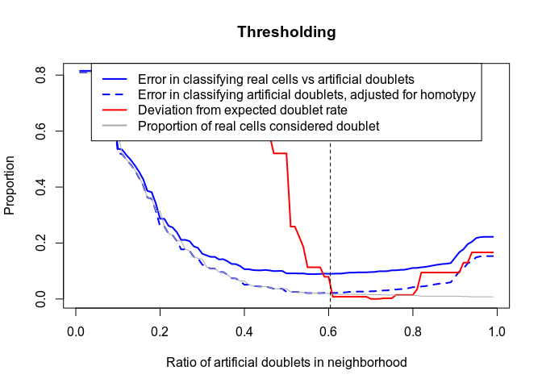
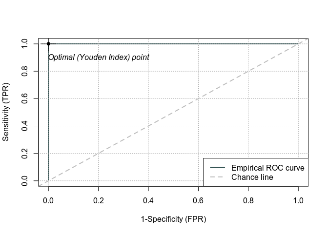
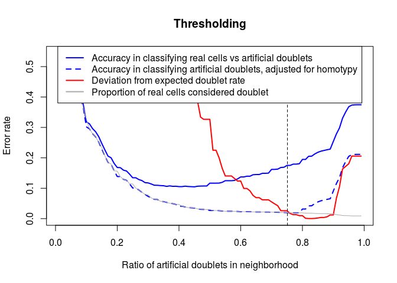
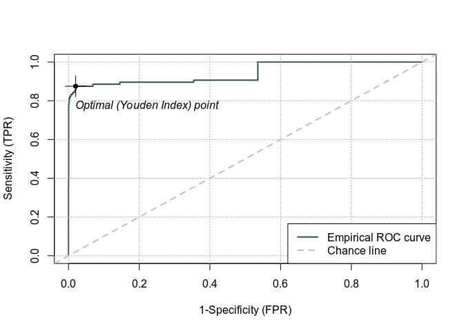
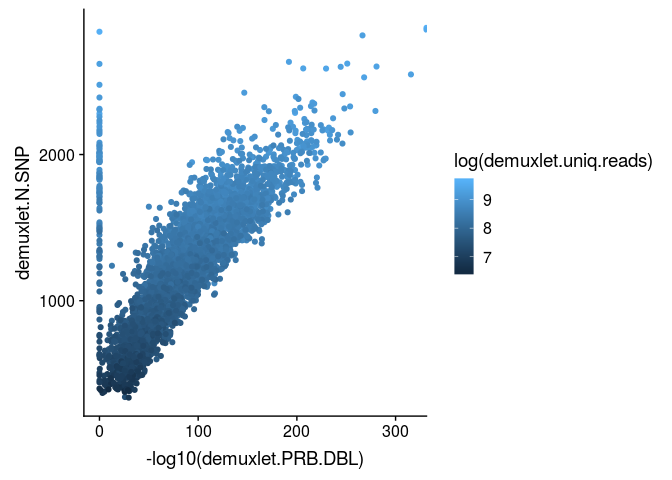
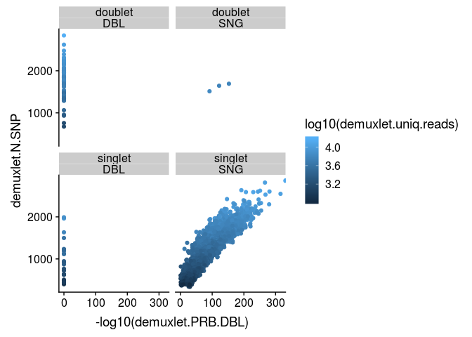
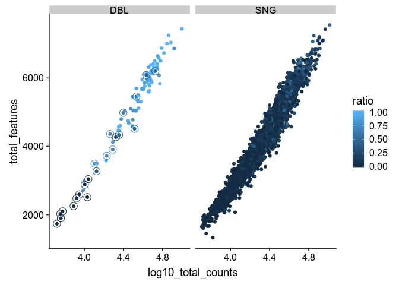

```r
suppressPackageStartupMessages({
  library(SingleCellExperiment)
  library(scran)
  library(igraph)
  library(ROCit)
  library(ggplot2)
  library(cowplot)
  library(plDoubletFinder)
})
```

This is an attempt at recreating the rough logic of [DoubletFinder](https://github.com/chris-mcginnis-ucsf/DoubletFinder), which creates random artificial doublets to detect real doublets, but in a more efficient manner (i.e. simpler, faster, and apparently more accurate). The main changes are:

* we work directly on a reduced count matrix (using rank correlation on top expressed genes, a la [scran](https://github.com/MarioniLab/scran) ), making the detection independent of downstream processing. This avoids the need for all the Seurat pre-processing, making the detection faster and compatible with other analytic choices.
* similarly to `scran` normalization, we use `scran::quickCluster` to first partition the cells into rough clusters, for a fraction of the doublets with prioritize pairs of cells across clusters. We also produce meta-cells from clusters, and create doublets and triplets from them. This strategy enables the detection of most doublets with much fewer artificial doublets.
* while we also rely on the expected proportion of doublets to threshold the scores, we include a variability in the estimate of the doublet proportion (`dbr.sd`), and use the error rate of the real/artificial predicition in conjunction with the deviation in global doublet rate to set the threshold.

The package is available at https://github.com/plger/plDoubletFinder and relies on [scran](https://github.com/MarioniLab/scran) for various steps. The approach is also very similar to [scran::doubletCells](https://rdrr.io/github/MarioniLab/scran/man/doubletCells.html) but simpler.

We test it on the mixology datasets, where doublets are known from the SNPs (multithreading disabled here).

# The 3 cell lines dataset


```r
set.seed(1234)
sce <- readRDS("../comparison/datasets/mixology10x3cl.SCE.rds")
# the command:
system.time(d <- plDoubletFinder(sce, 2000))
```

```
## Quick hclust clustering:
```

```
## Warning: Setting 'use.ranks=TRUE' for the old defaults.
## Set 'use.ranks=FALSE' for the new defaults.
```

```
## clusters
##   1   2   3   4 
## 313 275 179 135
```

```
## Identifying top genes per cluster...
```

```
## Creating ~2000 artifical doublets...
```

```
## Building KNN graph...
```

```
## Evaluating cell neighborhoods...
```

```
## Finding threshold...
```

```
## Threshold found:0.604
```

<!-- -->

```
##    user  system elapsed 
##   5.747   0.947   3.602
```

```r
# evaluation:
d$truth <- factor(as.character(sce$demuxlet_cls), levels=c("SNG","DBL"))
plot(rocit(d$ratio, d$truth), main="mixology 10x 3 cell lines")
```

<!-- -->

```r
table(truth=d$truth, predicted=d$classification)
```

```
##      predicted
## truth doublet singlet
##   SNG       8     887
##   DBL       7       0
```

That's somewhat too easy...

<br/><br/>

# The 5 cell lines dataset

Scran's `quickCluster` at the beginning is actually the time-consuming part; if already ran (e.g. in the context of scran normalization), it can be provided:


```r
sce <- readRDS("../comparison/datasets/mixology10x5cl.SCE.rds")
system.time(d <- plDoubletFinder(sce, clusters=sce$quickClusters))
```

```
## Identifying top genes per cluster...
```

```
## Creating ~3918 artifical doublets...
```

```
## Building KNN graph...
```

```
## Evaluating cell neighborhoods...
```

```
## Finding threshold...
```

```
## Threshold found:0.754
```

<!-- -->

```
##    user  system elapsed 
##   9.497   0.926   9.110
```

```r
d$truth <- factor(as.character(sce$demuxlet_cls), levels=c("SNG","DBL"))
plot(rocit(d$ratio, d$truth), main="mixology 10x 5 cell lines")
```

<!-- -->

```r
table(truth=d$truth, predicted=d$classification)
```

```
##      predicted
## truth doublet singlet
##   SNG       3    3819
##   DBL      74      22
```

Here it seems that we miss many doublets. However, it is quite likely that these are wrongly called doublets by `demuxlet`. The demuxlet probability of being a doublet is correlated with the number of SNPs and their coverage:


```r
CD <- cbind(d, as.data.frame(colData(sce)))
ggplot(CD, aes(-log10(demuxlet.PRB.DBL), demuxlet.N.SNP, colour=log(demuxlet.uniq.reads))) + geom_point()
```

<!-- -->

If we look at demuxlet doublets missed by our approach (lower-left panel below), they tend to have a lower number of SNPs and coverage:

```r
ggplot(CD, aes(-log10(demuxlet.PRB.DBL), demuxlet.N.SNP, colour=log10(demuxlet.uniq.reads))) + geom_point() + facet_wrap(classification~demuxlet_cls)
```

<!-- -->

A lot of them also do not show the high number of detected features with is so common (and expected) among doublets:

```r
p <- ggplot(CD, aes(log10_total_counts, total_features, colour=ratio)) + geom_point() + facet_wrap(~demuxlet_cls)
p + geom_point(data=CD[which(CD$demuxlet_cls=="DBL" & CD$classification=="singlet"),], shape=1, size=4)
```

<!-- -->

## Comparison with other methods

We next compare with `DoubletFinder` package, which took considerably longer to run. We followed the example on the vignette, with the exception of the doublet rate, which was set to the real value in this dataset.

The `DoubletFinder` confusion matrix:

```r
table(truth=CD$demuxlet_cls, predicted=CD$doubletFinder.class)
```

```
##      predicted
## truth doublet singlet
##   DBL      71      25
##   SNG      11    3811
```

Since `scran::doubletCells` doesn't threshold, we use the real number of doublets:

```r
# reducing the object doesn't affect scran accuracy and considerably speeds up:
sce.red <- sce[order(Matrix::rowMeans(counts(sce)), decreasing=TRUE)[1:3000],]
system.time(scores <- scran::doubletCells(counts(sce.red)))
```

```
##    user  system elapsed 
##  60.551   6.801  24.622
```

```r
scran.threshold <- scores[order(scores, decreasing=TRUE)[sum(sce$demuxlet_cls=="DBL")]]
scran.class <- ifelse(scores >= scran.threshold, "doublet", "singlet")
table(truth=CD$demuxlet_cls, predicted=scran.class)
```

```
##      predicted
## truth doublet singlet
##   DBL      59      37
##   SNG      37    3785
```

We also compare it to [scds](https://github.com/kostkalab/scds) :


```r
library(scds)
system.time({
  sce = cxds(sce)
  sce = bcds(sce)
  sce = cxds_bcds_hybrid(sce)
})
```

```
## [1]	train-error:0.072773+0.002107	test-error:0.101073+0.005460 
## Multiple eval metrics are present. Will use test_error for early stopping.
## Will train until test_error hasn't improved in 2 rounds.
## 
## [2]	train-error:0.064669+0.001465	test-error:0.089843+0.008728 
## [3]	train-error:0.051653+0.001947	test-error:0.080654+0.005093 
## [4]	train-error:0.046963+0.002897	test-error:0.078102+0.004961 
## [5]	train-error:0.039369+0.001832	test-error:0.069552+0.004451 
## [6]	train-error:0.036307+0.001279	test-error:0.068658+0.004743 
## [7]	train-error:0.033180+0.001114	test-error:0.063809+0.004696 
## [8]	train-error:0.030851+0.001559	test-error:0.063426+0.002796 
## [9]	train-error:0.027597+0.001590	test-error:0.060108+0.003560 
## [10]	train-error:0.024662+0.001364	test-error:0.057811+0.003048 
## [11]	train-error:0.022843+0.001006	test-error:0.057683+0.002644 
## [12]	train-error:0.021153+0.001333	test-error:0.057683+0.004442 
## [13]	train-error:0.019111+0.001635	test-error:0.056407+0.004135 
## [14]	train-error:0.017228+0.002021	test-error:0.054238+0.005033 
## [15]	train-error:0.015410+0.001482	test-error:0.053344+0.005123 
## [16]	train-error:0.013814+0.001290	test-error:0.052834+0.005651 
## [17]	train-error:0.012634+0.001237	test-error:0.050281+0.004941 
## [18]	train-error:0.011517+0.001161	test-error:0.049644+0.005024 
## [19]	train-error:0.010209+0.001354	test-error:0.048240+0.004725 
## [20]	train-error:0.009093+0.001445	test-error:0.047474+0.006083 
## [21]	train-error:0.008582+0.001116	test-error:0.047474+0.005341 
## [22]	train-error:0.006987+0.001035	test-error:0.046837+0.006853 
## [23]	train-error:0.006317+0.001270	test-error:0.046326+0.007246 
## [24]	train-error:0.005838+0.000848	test-error:0.047219+0.006774 
## [25]	train-error:0.005360+0.001108	test-error:0.046964+0.005948 
## Stopping. Best iteration:
## [23]	train-error:0.006317+0.001270	test-error:0.046326+0.007246
## 
## [1]	train-error:0.069806 
## Will train until train_error hasn't improved in 2 rounds.
## 
## [2]	train-error:0.064957 
## [3]	train-error:0.050664 
## [4]	train-error:0.047856 
## [5]	train-error:0.039433 
## [6]	train-error:0.038668 
## [7]	train-error:0.034329 
## [8]	train-error:0.031521 
## [9]	train-error:0.029990 
## [10]	train-error:0.027310 
## [11]	train-error:0.024375 
## [12]	train-error:0.021695 
## [13]	train-error:0.019653 
## [14]	train-error:0.018760 
## [15]	train-error:0.017101
```

```
##    user  system elapsed 
##  45.873   1.503  28.242
```

```r
scds.threshold <- sce$hybrid_score[order(sce$hybrid_score, decreasing=TRUE)[sum(sce$demuxlet_cls=="DBL")]]
scds.class <- ifelse(sce$hybrid_score >= scds.threshold, "doublet", "singlet")
table(truth=sce$demuxlet_cls, predicted=scds.class)
```

```
##      predicted
## truth doublet singlet
##   DBL      57      39
##   SNG      39    3783
```


```r
truth <- factor(CD$demuxlet_cls, c("SNG","DBL"))
roclist <- lapply( list(pl.ratio=CD$ratio,
                        DoubletFinder.p=CD$doubletFinder.pANN_0.25_0.02_82,
                        scran.score=scores,
                        scds.hybrid=sce$hybrid_score), 
                   class=truth, FUN=rocit)
colors <- c("blue","red","black","pink")
plot(roclist[[1]], lwd=2, col=c(colors[[1]], "grey"), legend=FALSE, YIndex=FALSE)
for(i in 2:length(roclist)){
  lines(roclist[[i]]$FPR, roclist[[i]]$TPR, lwd=2, col=colors[[i]])
}
legend("bottomright", fill=colors, legend=names(roclist))
```

<!-- -->


```r
sessionInfo()
```

```
## R version 3.6.0 (2019-04-26)
## Platform: x86_64-pc-linux-gnu (64-bit)
## Running under: Ubuntu 18.04.2 LTS
## 
## Matrix products: default
## BLAS:   /usr/lib/x86_64-linux-gnu/openblas/libblas.so.3
## LAPACK: /usr/lib/x86_64-linux-gnu/libopenblasp-r0.2.20.so
## 
## locale:
##  [1] LC_CTYPE=en_US.UTF-8       LC_NUMERIC=C              
##  [3] LC_TIME=de_CH.UTF-8        LC_COLLATE=en_US.UTF-8    
##  [5] LC_MONETARY=de_CH.UTF-8    LC_MESSAGES=en_US.UTF-8   
##  [7] LC_PAPER=de_CH.UTF-8       LC_NAME=C                 
##  [9] LC_ADDRESS=C               LC_TELEPHONE=C            
## [11] LC_MEASUREMENT=de_CH.UTF-8 LC_IDENTIFICATION=C       
## 
## attached base packages:
## [1] parallel  stats4    stats     graphics  grDevices utils     datasets 
## [8] methods   base     
## 
## other attached packages:
##  [1] scds_1.0.0                  plDoubletFinder_0.1        
##  [3] cowplot_0.9.4               ggplot2_3.1.1              
##  [5] ROCit_1.1.1                 igraph_1.2.4.1             
##  [7] scran_1.12.0                SingleCellExperiment_1.6.0 
##  [9] SummarizedExperiment_1.14.0 DelayedArray_0.10.0        
## [11] BiocParallel_1.18.0         matrixStats_0.54.0         
## [13] Biobase_2.44.0              GenomicRanges_1.36.0       
## [15] GenomeInfoDb_1.20.0         IRanges_2.18.0             
## [17] S4Vectors_0.22.0            BiocGenerics_0.30.0        
## [19] rmarkdown_1.12             
## 
## loaded via a namespace (and not attached):
##  [1] bitops_1.0-6             fs_1.3.1                
##  [3] usethis_1.5.0            devtools_2.0.2          
##  [5] rprojroot_1.3-2          dynamicTreeCut_1.63-1   
##  [7] tools_3.6.0              backports_1.1.4         
##  [9] R6_2.4.0                 irlba_2.3.3             
## [11] vipor_0.4.5              lazyeval_0.2.2          
## [13] colorspace_1.4-1         withr_2.1.2             
## [15] tidyselect_0.2.5         gridExtra_2.3           
## [17] prettyunits_1.0.2        processx_3.3.1          
## [19] compiler_3.6.0           cli_1.1.0               
## [21] BiocNeighbors_1.2.0      desc_1.2.0              
## [23] labeling_0.3             scales_1.0.0            
## [25] callr_3.2.0              stringr_1.4.0           
## [27] digest_0.6.18            XVector_0.24.0          
## [29] scater_1.12.0            pkgconfig_2.0.2         
## [31] htmltools_0.3.6          sessioninfo_1.1.1       
## [33] limma_3.40.0             rlang_0.3.4             
## [35] DelayedMatrixStats_1.6.0 dplyr_0.8.0.1           
## [37] RCurl_1.95-4.12          magrittr_1.5            
## [39] BiocSingular_1.0.0       GenomeInfoDbData_1.2.1  
## [41] Matrix_1.2-17            Rcpp_1.0.1              
## [43] ggbeeswarm_0.6.0         munsell_0.5.0           
## [45] viridis_0.5.1            stringi_1.4.3           
## [47] yaml_2.2.0               edgeR_3.26.0            
## [49] zlibbioc_1.30.0          pkgbuild_1.0.3          
## [51] plyr_1.8.4               grid_3.6.0              
## [53] dqrng_0.2.0              crayon_1.3.4            
## [55] lattice_0.20-38          locfit_1.5-9.1          
## [57] knitr_1.22               ps_1.3.0                
## [59] pillar_1.3.1             xgboost_0.82.1          
## [61] pkgload_1.0.2            glue_1.3.1              
## [63] evaluate_0.13            data.table_1.12.2       
## [65] BiocManager_1.30.4       remotes_2.0.4           
## [67] testthat_2.1.1           gtable_0.3.0            
## [69] purrr_0.3.2              assertthat_0.2.1        
## [71] xfun_0.6                 rsvd_1.0.0              
## [73] viridisLite_0.3.0        tibble_2.1.1            
## [75] beeswarm_0.2.3           memoise_1.1.0           
## [77] statmod_1.4.30
```
